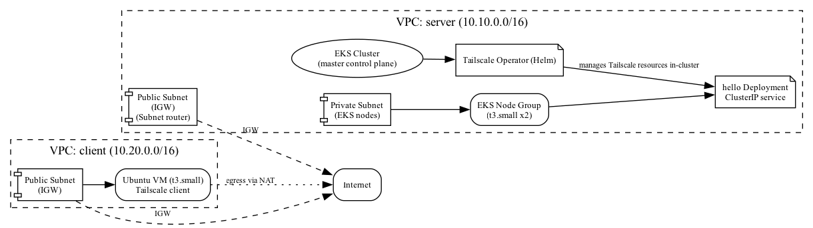
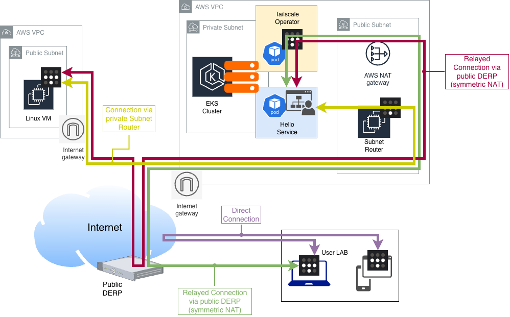

# Tailscale Lab for hybrid connectivity to AWS EKS

## Summary
This first lab evaluates the following:
- Set up a CI/CD pipeline that deploys the hybrid AWS environment using Tailscale for connectivity.
- Deploy the AWS environment (EKS + VM) and bootstrap as much as possible (EKS cluster and basic Tailscale onboarding).
- Use basic tools to confirm connectivity and measure latency (ping/icmp).

Out of scope for this lab:
- Harden the EKS setup for production (avoid public access/endpoints and adopt a minimalist approach instead of using the default AWS module).

**Note:** This repository first commit was 100% generated by GitHub CoPilot in less than 15m with less than 5 prompts detailing design and its modules: secrets, runner and the lab itself. Another day+ of work was spent to review code, test, troubleshoot and fix bugs before the lab could finally be leveraged to achieve the main goal to verify Tailscale networking in AWS hybrid environment with NAT gateway.


## LAB Topology
This is the original version generated by AI and rendered by **Graphviz DOT**. It is kept here for comparison purposes :)




A slightly improved version (made by humans with draw.io):



## Repository Structure

### Folders created:
- `terraform/runner`: Terraform to launch an EC2 instance to serve as a self-hosted GitHub Actions runner.
- `terraform/github-secrets`: Terraform to create GitHub Actions repository secrets to store AWS and Tailscale credentials for the pipeline. This workspace implies a local `terraform apply` to upload secrets.
- The `terraform/lab` Terraform scope details:
    - Builds two VPCs (`server` and `client`).
    - Creates an EKS cluster in the `server` VPC and deploys a basic `hello-ts-world` app and the Tailscale Operator via Helm.
    - Creates a Linux VM in the `client` VPC that connects to the internet and runs the Tailscale client.
    - Provides an optional Tailscale subnet-router instance to bypass the NAT gateway fronting the `hello-ts-world`.

### Notes and caveats:
- This lab is intentionally permissive from an IAM perspective. Review IAM and security-group settings before using it in your environment.
- The runner EC2 will require admin permissions for AWS services: VPC, EC2, EKS, KMS, SSM, IAM, and CloudWatch Logs.


### Quick example to build self-hosted runner
```bash
cd terraform/runner
terraform init
terraform plan
terraform apply
```

### Quick example to upload secrets to GitHub
```bash
cd terraform/github-secrets
export TF_VAR_github_token="ghp_..."
export TF_VAR_github_owner="my-org"
export TF_VAR_repository="my-repo"
export TF_VAR_aws_access_key_id="..."
export TF_VAR_aws_secret_access_key="..."
export TF_VAR_aws_session_token="..." # optional
terraform init
terraform apply
```

### Quick example to run with GitHub Actions
Reference: https://docs.github.com/en/actions/how-tos/manage-workflow-runs/manually-run-a-workflow
Make sure to upload the GitHub repository secrets before proceeding.

Enter the following variables:
```
Terraform target subfolder: lab
Terraform operation: plan/apply/destroy
AWS region: us-west-2
S3 bucket for Terraform remote state: bucket-name
```

## Lessons learned while using GitHub Copilot
1. GitHub Copilot generated a usable initial draft with a few prompts, but where context was missing it suggested approaches that were incomplete or incompatible (for example, non-standard ways to install Tailscale via Helm).
2. The AI assistant references were somewhat outdated white setting up the AWS modules. Addition code review was necessary to address incompatibilities across selected versions.
3. When troubleshooting EKS deployments, avoid prolonged ad-hoc kubectl changes that can create cascading issues; instead start from a clear, minimal configuration and iterate back with the AI assistance as needed.
4. During the subnet-router design review, some GitHub Copilot suggestions produced hallucinations (non-existing Terraform resources or arguments). Be cautious and validate provider schemas when applying provider-specific resources.


## Resources
1. https://tailscale.com/kb/1210/terraform-provider
2. https://tailscale.com/blog/kubernetes-direct-connections
3. https://tailscale.com/kb/1236/kubernetes-operator
4. https://github.com/tailscale/tailscale/blob/main/cmd/k8s-operator/deploy/manifests/operator.yaml
5. https://github.com/rrotaru/eks-over-tailscale/tree/main
6. https://github.com/jaxxstorm/tailscale-examples
7. https://tailscale.com/kb/1406/quick-guide-subnets
8. https://tailscale.com/kb/1438/kubernetes-operator-cluster-egress#access-an-ip-address-behind-a-subnet-router
9. https://tailscale.com/kb/1214/site-to-site
10. https://tailscale.com/kb/1296/aws-reference-architecture


## Connectivity tests and Results
1. From a laptop connected to the Tailscale network, ssh to the AWS client VM.
```bash
ssh root@aws-linux-vm
```
2. Then access the "Hello World" service using the MagicDNS FQDN as well as its IP via subnet router (relay bypass). Use **time** to compare the results. Please note that this service is configured as **NodePort** type which is valid for lab purposes but insufficient for at scale environments.

```bash
# Via EKS Tailscale Operator + DERP relay

root@ip-10-20-1-140:~# mtr hello-ts-world -T -P 80 --report
Start: 2025-12-19T22:14:29+0000
HOST: ip-10-20-1-140              Loss%   Snt   Last   Avg  Best  Wrst StDev
  1.|-- hello-ts-world.taild       0.0%    10   13.1  15.8  13.1  30.5   5.2

root@ip-10-20-1-140:~# time curl hello-ts-world
hello from EKS

real	0m0.054s
user	0m0.004s
sys	    0m0.006s

# Via Tailscale subnet router in public subnet (NAT bypass)

root@ip-10-20-1-140:~# mtr 10.10.12.154 -T -P 30080 --report
Start: 2025-12-19T22:13:59+0000
HOST: ip-10-20-1-140              Loss%   Snt   Last   Avg  Best  Wrst StDev
  1.|-- tailscale-subnet-router.t  0.0%    10    1.0   1.7   0.9   6.9   1.8
  2.|-- ip-10-10-12-154.us-west-2  0.0%    10    1.9   2.3   1.6   4.3   0.9

root@ip-10-20-1-140:~# time curl 10.10.12.154:30080
hello from EKS

real	0m0.021s
user	0m0.005s
sys	    0m0.004s
```

3. Conclusion: 
    * The latency gains to avoid Tailscale DERP relay are considerable.
    * Using a standalone subnet router to handle ingress EKS traffic is meant for testing purposes only.


## Possible improvements
1. Validate steps to identify NAT types (with/without NAT gateway + relay).
2. Automate connectivity tests.
3. Add logging and monitoring with Grafana.
4. Explore other EKS cluster designs to avoid egress NAT gateways.