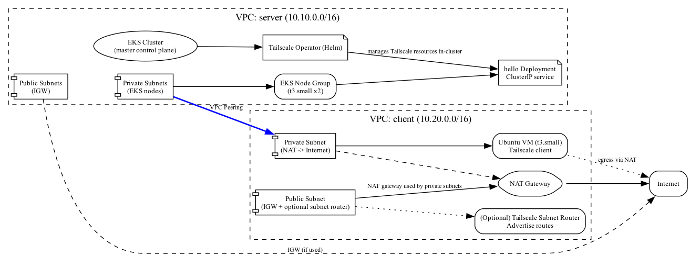

# Lab Topology

This directory contains a Graphviz DOT file (`topology.dot`) that describes the lab topology.

Key elements:

- Two VPCs in `us-west-2`:
  - `server` VPC (10.10.0.0/16): hosts an EKS cluster (control plane + managed node group) in private subnets, a `hello` deployment/service, and the Tailscale Operator installed via Helm.
  - `client` VPC (10.20.0.0/16): hosts an Ubuntu VM in a private subnet (egress via a NAT Gateway in the public subnet) running the Tailscale client. Optionally a public-subnet Tailscale subnet router can be provisioned to advertise the client VPC private CIDRs to Tailscale.
- A VPC peering connection connects the two VPCs allowing cross-VPC traffic between private subnets.


Open `topology.png` to view the diagram. You can also render SVG:

```bash
dot -Tsvg topology.dot -o topology.svg
```

If you'd like, I can also:

- Add a PlantUML version for easier editing in Markdown-aware renderers.
- Generate an embedded PNG and add it to the repo.
- Produce a more detailed per-subnet connectivity table.

Render the diagram (requires Graphviz `dot`):

```bash
cd terraform/lab
dot -Tpng topology.dot -o topology.png
```

Or render SVG instead of PNG:

```bash
dot -Tsvg topology.dot -o topology.svg
```

Rendered PNG

The diagram has been rendered to `topology.png` and is embedded below for quick viewing.


